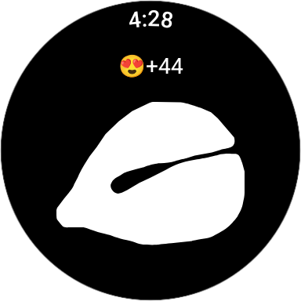
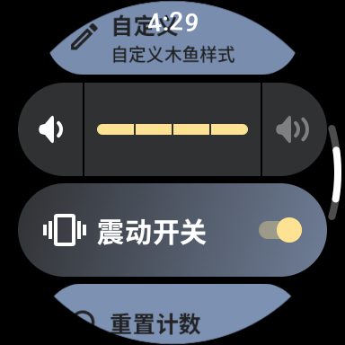
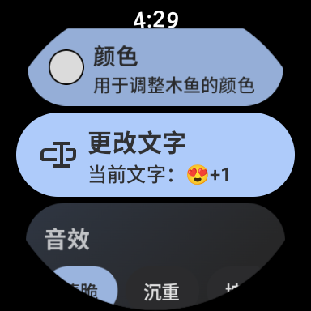

# woodfish-wear-os 电子木鱼
在安卓手表上的电子木鱼应用
用 jetpack compose 开发
## 应用截图

| 设备类型 | 截图A | 截图B | 截图C |
|----------|------|--------|------|
| 圆屏 |   |  |  |

## 资源注明
应用中的音效[音频文件](https://github.com/wooze-pao/woodfish-wear-os/tree/main/app/src/main/res/raw)来自[https://muyv.saop.cc/](https://muyv.saop.cc/)

应用中图标来自[figma(Free-Icon-Pack-1800)](https://www.figma.com/design/Rec0uUDs82LQtkZOaksmwk/Free-Icon-Pack-1800--icons--Community-?m=auto&t=8GrhCzxdiydz6eMC-6)
